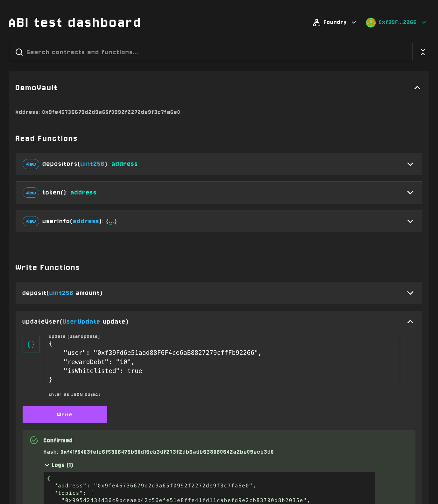

# abi-test

Interactive ABI testing tool for local development of Ethereum smart contracts. Test contract functions through a user-friendly UI without writing code.

It's like Swagger UI, but for Solidity.



## Features

- **Permissionless and free**: Runs locally with Anvil or Hardhat without any Subscription or API key.
- **Lean and fast UX**: Search contracts and functions and prepare calls within seconds.
- **Smart Input Detection**: Automatically provides appropriate input components based on parameter types (bool, address, uint, bytes, arrays, tuples). Easy timestamp handling with custom datetime picker.
- **Enum Support**: Define enum mappings for better UX on enum parameters
- **Transaction Tracking**: View pending/confirmed transactions with logs and receipts
- **Multi-chain Support**: Configure per-chain addresses and automatic chain switching
- **Block Explorer Integration**: Clickable links to addresses and transactions

## Quick Start

The fastest way to get started is using npx:

```bash
npx abi-test --chain-id 1 -c 0x1234...abcd:MyToken -k YOUR_ETHERSCAN_API_KEY
```

This spawns a local web UI where you can interact with your contracts immediately. `-c` for contact can be used multiple times like `-c {address}:{name} -c ...`

## Installation

```bash
npm install abi-test
```

## Usage

### Option 1: Standalone UI via npx

Spawn a local web server with the testing UI:

```bash
# With a config file
npx abi-test abi-test.config.ts

# With inline contracts
npx abi-test --chain-id 1 -c 0xC02aaA39b223FE8D0A0e5C4F27eAD9083C756Cc2:WETH

# With custom RPC and explorer
npx abi-test --chain-id 1 -r https://my-rpc.com -x https://etherscan.io
```

Run `npx abi-test --help` to see all available options.

#### Configuration File

Create an `abi-test.config.ts` (or `.js`/`.json`) file:

```typescript
import { type AbiTestConfig } from "abi-test";

const config: AbiTestConfig = {
    contracts: [
        {
            name: "MyToken",
            address: "0x1234...abcd",
            // ABI can be inline, a file path, or a file import, generated with the Wagmi CLI
            abi: [/* ... */],
            enums: {
                Status: ["Pending", "Active", "Closed"]
            }
        }
    ],
    chainId: 1,
    blockExplorerUrl: "https://etherscan.io",
    rpcUrl: "https://mainnet.infura.io/v3/YOUR_KEY"
};

export default config;
```

### Option 2: Embed React Component

You can embed the `AbiTest` component directly into your React application. This is useful when you want to:

- **Integrate with your existing dApp**: Add contract testing capabilities alongside your main application without switching contexts
- **Use your existing wallet connection**: Leverage your app's already-configured Wagmi provider and connected wallet
- **Customize the experience**: Apply your own theming, add surrounding UI, or conditionally show the tester based on user roles
- **Build internal tools**: Create admin dashboards or developer tools where contract interaction is just one part of the interface

#### Peer Dependencies for embedding as a component

You will need [Material UI](https://mui.com/material-ui/getting-started/installation/) and it's dependencies to be installed.

Ensure you have these peer dependencies installed:

```bash
npm install react react-dom viem wagmi @tanstack/react-query
```

#### Example

```tsx
import { AbiTest, type ResolvedContractConfig } from "abi-test";
import { WagmiProvider } from "wagmi";
import { QueryClientProvider, QueryClient } from "@tanstack/react-query";
import { ThemeProvider } from "@mui/material/styles";
import { http, createConfig } from "wagmi";
import { mainnet } from "wagmi/chains";

const config = createConfig({
    chains: [mainnet],
    transports: { [mainnet.id]: http() }
});

const queryClient = new QueryClient();

const contracts: ResolvedContractConfig[] = [
    {
        name: "WETH",
        address: "0xC02aaA39b223FE8D0A0e5C4F27eAD9083C756Cc2",
        abi: [/* your ABI here */],
        enums: {
            // Optional: map enum parameter names to their string values
            Status: ["Pending", "Active", "Closed"]
        }
    }
];

function App() {
    return (
        <WagmiProvider config={config}>
            <QueryClientProvider client={queryClient}>
                <AbiTest
                    contracts={contracts}
                    chainId={mainnet.id}
                    blockExplorerUrl="https://etherscan.io"
                />
            </QueryClientProvider>
        </WagmiProvider>
    );
}
```

#### Props

| Prop | Type | Description |
|------|------|-------------|
| `contracts` | `ResolvedContractConfig[]` | Array of contract configurations |
| `chainId` | `number` | Optional. Auto-switches wallet to this chain |
| `blockExplorerUrl` | `string` | Optional. Base URL for address/tx links |

#### Contract Configuration

```typescript
interface ResolvedContractConfig {
    name: string;
    abi: Abi;  // Viem ABI type
    address: string | Record<number, `0x${string}`>;  // Single or per-chain
    enums?: Record<string, string[]>;  // Map enum names to values
}
```

## Development

```bash
# Start dev server
npm run dev

# Build all outputs (library, CLI app, CLI)
npm run build

# Type check
npm run test

# Lint
npm run lint
```

## License

ISC
